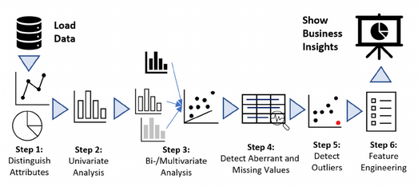

## Exploratory Data Analysis - Coffee Beans Consumer Insight

> [Back to HomePage](https://github.com/niddyhaw/data-analysis-portofolio)

### Content List
 - [Overview](#overview)
 - [Tools and Dataset](#tools-and-dataset)
 - [*Exploratory Data Analysis*](#exploratory-data-analysis)
    - [Load Data from Github to Google Colab](#1-load-data-ke-google-colab)

### *Overview*
- **Perusahaan XYZ** merupakan yang bergerak dalam **penjualan bijih kopi kepada pelanggan di 3 negara yakni Amerika, Irlandia dan Inggris**. 
- Perusahaan berupaya **mengandalkan data penjualan mentah** untuk mengetahui informasi kinerja, trend dan statistik penjualan secara umum. Akan tetapi, proses analisis menggunakan data mentah langsung seringkali **kurang** memberikan pemahaman mendalam *(insight)* dan **rentan** terhadap adanya kesalahan *(outlier)* serta anomali data. 
- Proyek ini berupaya untuk menerapkan analisis data eksploratif *(exploratory data analysis)* untuk **mengetahui pola dan karakteristik pelanggan** serta **mengidentifikasi adanya kesalahan dan anomali** guna mendapatkan pemahaman mengenai pelanggan dari bijih kopi di perusahaan XYZ dalam setahun terakhir. 

### *Tools and Dataset*
- Dataset : [Repositori mochen862](https://github.com/mochen862/excel-project-coffee-sales)
- Bahasa Pemrograman : *Python*.
- *Notebook Platform* : *Google Colab*.

### *Exploratory Data Analysis*

**Analisis data eksploratif** atau **_Exploratory Data Analysis_ _(EDA)_** merupakan proses awal yang dapat dilakukan untuk memahami suatu data berserta karakteristiknya. Dengan adanya **_EDA,_** kita dapat dengan mudah memahami pola, identifikasi kesalahan atau anomai serta mampu mengeksplorasi hubungan antar variabel dalam data. Menurut [Tufféry, S.](#referensi) pada buku berjudul *Data mining and statistics for decision making* tahun 2011, **EDA** pada umunya terdiri dari 6 tahapan yakni : 

1. Identifikasi Atribut 
2. Analisis secara Univariat
3. Analisis secara Bi-Multivariat
4. Deteksi *Missing Value* dan Anomali
5. Deteksi *Outlier* 
6. *Feature Engineering*

     
    
    
 Tahapan dari EDA

     

Selanjutnya kita akan menerapkan *EDA* secara bertahap pada dataset menggunakan pemrograman *Python* di *Google Colab*. 

***Lets Get Started!***

#### 1. Load Data to Google Colab
Dataset ini didapatkan dari 

### Referensi 
1. Tufféry, S. (2011). [*Data mining and statistics for decision making*](https://onlinelibrary.wiley.com/doi/book/10.1002/9780470979174). John Wiley & Sons.