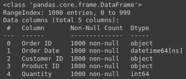

## Exploratory Data Analysis - Coffee Beans Sales Insight

> [Back to HomePage](https://github.com/niddyhaw/data-analysis-portofolio)

### Content List
 - [Overview](#overview)
 - [Tools and Dataset](#tools-and-dataset)
 - [*Exploratory Data Analysis*](#exploratory-data-analysis)
    - [Load Data from Github to Google Colab](#load-data-to-google-colab)
    - [Distinguist Attribute](#distinguist-attributes)

### *Overview*
**Perusahaan XYZ** merupakan yang bergerak dalam **penjualan bijih kopi kepada pelanggan di 3 negara yakni Amerika, Irlandia dan Inggris**. 

Perusahaan berupaya **mengandalkan data penjualan mentah** untuk mengetahui informasi kinerja, trend dan statistik penjualan secara umum. Akan tetapi, proses analisis menggunakan data mentah langsung seringkali **kurang** memberikan pemahaman mendalam *(insight)* dan **rentan** terhadap adanya kesalahan *(outlier)* serta anomali data. 

Proyek ini berupaya untuk menerapkan analisis data eksploratif *(exploratory data analysis)* untuk **mengetahui pola dan karakteristik pelanggan** serta **mengidentifikasi adanya kesalahan dan anomali** guna mendapatkan pemahaman mengenai pelanggan dari bijih kopi di perusahaan XYZ dalam setahun terakhir. 

### *Tools*
- Bahasa Pemrograman : *Python*.
- *Notebook Platform* : *Google Colab*.

### *Exploratory Data Analysis*

> **Analisis data eksploratif** atau **_Exploratory Data Analysis_ _(EDA)_** merupakan proses awal 
yang dapat dilakukan untuk memahami suatu data berserta karakteristiknya. Dengan adanya **_EDA,_** kita dapat dengan mudah memahami pola, identifikasi kesalahan atau anomai serta mampu mengeksplorasi hubungan antar variabel dalam data. 

> Menurut [Tufféry, S](#referensi) pada buku berjudul *Data mining and statistics for decision making* tahun 2011, **EDA** pada umunya terdiri dari 6 tahapan yakni Identifikasi Atribut, Analisis secara Univariat, Analisis secara Bi-Multivariat, Deteksi *Missing Value* dan Anomali, Deteksi *Outlier*, *Feature Engineering*.

<p align="center">
    <br>
    
    <p align="center"> Tahapan dari EDA</p>
    <br>
</p>


Selanjutnya kita akan menerapkan *EDA* secara bertahap pada dataset menggunakan pemrograman *Python* di *Google Colab*. 

***Lets Get Started!***


#### Load Data to Google Colab Using Python
1. Buka _Google Colab_.
2. Impor pustaka yang dibutuhkan (**requests** dan **pandas**).
    ```pyhton
    import pandas as pd
    import requests
    ```

3. Unduh file [coffeeOrderData.xlsx](https://github.com/mochen862/excel-project-coffee-sales)dari repositori mochen862 ke _Google Colab_.
    ```python
        url = "https://github.com/mochen862/excel-project-coffee-sales/raw/main/coffeeOrdersDataxlsx"
    response = requests.get(url)
        
    with open("coffeeOrdersData.xlsx", "wb") as file:
        file.write(response.content)
    ```

4. Ekstrak file ke dalam format _dataframe_ menggunakan _pandas_.
    > DataFrame adalah struktur data dua dimensi (kolom & baris) dalam bahasa pemrograman komputer _Python_ yang mirip dengan tabel di _Microsoft Excel_.

    ```python
    xls = pd.ExcelFile('coffeeOrdersData.xlsx')
    print(xls.sheet_names)
    
    orders = pd.read_excel(xls, 'orders')
    customers = pd.read_excel(xls, 'customers')
    products = pd.read_excel(xls, 'products')
    ```

5. Dataframe Order, Produk dan Pelanggan.
> Fungsi _.info()_ memberikan informasi mengenai nama, jumlah baris yang tidak kosong dan tipe data masing-masing atribut. 
    <table>
      <tr>
        <td> <p align="center">Info Dataframe Order</p></td>
        <td> <p align="center">Info Dataframe Pelanggan</p></td>
        <td> <p align="center">Info Dataframe Produk</p></td>
      </tr>
      <tr>
        <td>
        <td></td>
        <td></td>
      </tr>
    </table>

6. Menggabungkan dataframe kedalam 1 tabel untuk efensiesi analisis.
```python
df = pd.merge(pd.merge(orders.dropna(axis=1), customers, on="Customer ID", how="left"), products, on="Product ID", how="left")
```
<p align="center">
    <br>
    
    <p align="center"> Info dari data gabungan</p>
    <br>
</p>


7. Menerapkan de-identifikasi data untuk menjaga privasi pelanggan.

> **De-identifikasi** adalah proses menghilangkan atau menutupi informasi pengenal pribadi (PII) untuk mengurangi risiko adanya keterkaitan identitas subjek dengan data. Terdapat beberapa informasi pribadi yang perlu dihilangkan pada dataset ini diantara lain Nama Pelanggan _(Customer Name)_, Email _(Email)_, Nomor Telepon _(Phone Number)_, Alamat _(Address Line 1)_ dan Kode Pos _(Poscode)_.

```python
df = df[df.columns.drop(['Customer Name', 'Email', 'Phone Number', 'Address Line 1', 'Postcode'])]
```

<p align="center">
    <br>
    
    <p align="center"> Info data setelah de-identifikasi data </p>
    <br>
</p>


***Dataset Ready!, Lets Identify Each Attribute***


#### Distinguist Attributes
Proses idenfikasi atribut pada sesi ini menggunakan fungsi _.describe()_ untuk menghasilkan deskripsi dari masing-masing atribut sebagai berikut: 
1. Atribut Kategorik
> Fungsi fungsi _.describe()_ pada atribut kategorik memberikan deskripsi tentang jumlah baris yang tidak kosong _(count)_, jumlah nilai yang unik _(unique)_, nilai yang paling sering muncul _(top)_ dan jumlah frequensi pada nilai yang paling sering muncul _(freq)_ pada suatu atribut. 

```python
df.select_dtypes(include='object').describe().transpose()
```


2. Atribut Numerik
```python
df.select_dtypes(include='object').describe().transpose()
```

### Referensi 
1. Tufféry, S. (2011). [*Data mining and statistics for decision making*](https://onlinelibrary.wiley.com/doi/book/10.1002/9780470979174). John Wiley & Sons.
2. Cote